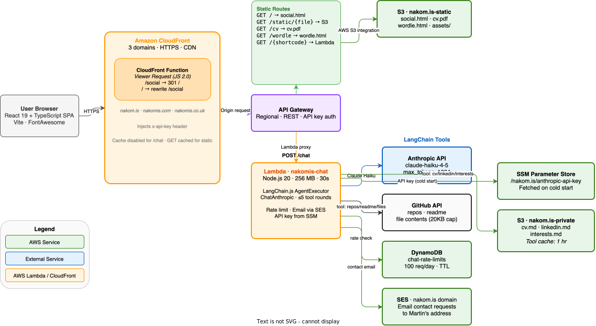

# nakom.is Social App

The React SPA that serves as the landing page for [nakom.is](https://nakom.is). It's a personal profile page with social links and an AI chat powered by Claude.

## Architecture



### Frontend (this app)

- **React 19 + TypeScript**, bundled with Vite
- Served from S3 via CloudFront at the root path `/`
- No client-side routing — single page, no router

### Backend (Lambda)

- **Chat Lambda** (`lambda/chat/`) — Node.js 20, handles all `/chat` API requests
- Uses **LangChain.js** (`ChatAnthropic` + `AgentExecutor`) to run a tool-calling agentic loop
- Model: `claude-haiku-4-5-20251001` (fast, cost-effective)
- **Rate limiting** via DynamoDB (daily global limit)
- **Email capture** via SES — when a visitor leaves their email, it's forwarded to Martin

### AI tools available to the chat agent

| Tool | Description |
|------|-------------|
| `get_cv` | Reads `cv.md` from private S3 bucket |
| `get_linkedin_profile` | Reads `linkedin.md` from private S3 bucket |
| `get_interests` | Reads `interests.md` from private S3 bucket |
| `get_github_readme` | Fetches README for a GitHub repo |
| `list_repo_files` | Lists files/directories in a GitHub repo |
| `read_repo_file` | Reads a specific file from a GitHub repo (20KB cap) |

### Infrastructure

- **CloudFront** — CDN, SSL termination, `/social` → `/` redirect, injects API key as `x-api-key` header
- **API Gateway** — routes `/chat` POST to the Lambda
- **S3 (public)** — serves the built React app from `/static/social-app/`
- **S3 (private)** — stores `cv.md`, `linkedin.md`, `interests.md` (not publicly accessible)
- **DynamoDB** — rate limit counters
- **SES** — outbound email for contact capture
- **SSM Parameter Store** — stores the Anthropic API key (encrypted)

## API contract

### `POST /chat`

**Request (normal message):**
```json
{
  "messages": [
    { "role": "user", "content": "Tell me about your experience" },
    { "role": "assistant", "content": "Sure! ..." },
    { "role": "user", "content": "What about cloud?" }
  ]
}
```

**Request (email submission):**
```json
{
  "messages": [...],
  "emailAddress": "visitor@example.com"
}
```

**Response (200):**
```json
{
  "message": "The assistant's reply",
  "remaining": 87,
  "requestEmail": true
}
```
`requestEmail` is only present when the AI wants to trigger the email capture UI.

**Error responses:**
- `400` — missing/invalid body, invalid message format, invalid email
- `429` — daily rate limit exceeded
- `500` — internal server error

### Rate limiting

The Lambda enforces a global daily request limit (configurable via the `DAILY_RATE_LIMIT` environment variable, default 100). Remaining capacity is returned in every response.

### Email capture flow

1. The AI appends `[REQUEST_EMAIL]` to its response when contact capture is appropriate
2. The Lambda strips the token and sets `requestEmail: true` in the response
3. The frontend shows an email input field
4. On submission, the client re-POSTs with `emailAddress` set
5. The Lambda forwards the email address + last 6 messages of conversation to Martin via SES

### Conversation limits

- Max 10 user turns per session (enforced client-side)
- Last 20 messages sent to the Lambda (backend cap)
- Max 2000 characters per message

## Components

| Component | Description |
|-----------|-------------|
| `App.tsx` | Root layout — arranges social links, chat widget, and SVG connector lines |
| `SocialLinks.tsx` | Row of icon links (CV, LinkedIn, GitHub, Bluesky, Facebook, Twitter) |
| `ChatWidget.tsx` | Full chat UI — message history, input, email capture, loading state |
| `ChatMessage.tsx` | Individual message bubble (user / assistant) |
| `ConnectorLines.tsx` | Decorative SVG lines connecting social links to the chat panel |
| `types.ts` | Shared TypeScript interfaces (`ChatMessage`, `ChatResponse`, `ChatError`) |

## Local development

```bash
cd social-app
npm install
npm run dev
```

The dev server proxies `/chat` requests via `vite.config.ts`. You'll need the Lambda running locally or pointing at a deployed API Gateway URL.

## Build & deploy

```bash
cd social-app
npm run build
bash scripts/deploy.sh
```

The deploy script syncs `dist/` to the S3 public bucket under `/static/social-app/` and invalidates the CloudFront cache.

## Architecture diagram

`architecture.drawio` is the source for the diagram above. The SVG is auto-generated on commit by the pre-commit hook in `.githooks/pre-commit`. To activate the hook:

```bash
git config core.hooksPath .githooks
```

To regenerate the SVG manually:

```bash
/Applications/draw.io.app/Contents/MacOS/draw.io -x social-app/architecture.drawio -f svg -s 1 social-app/architecture.svg
```
