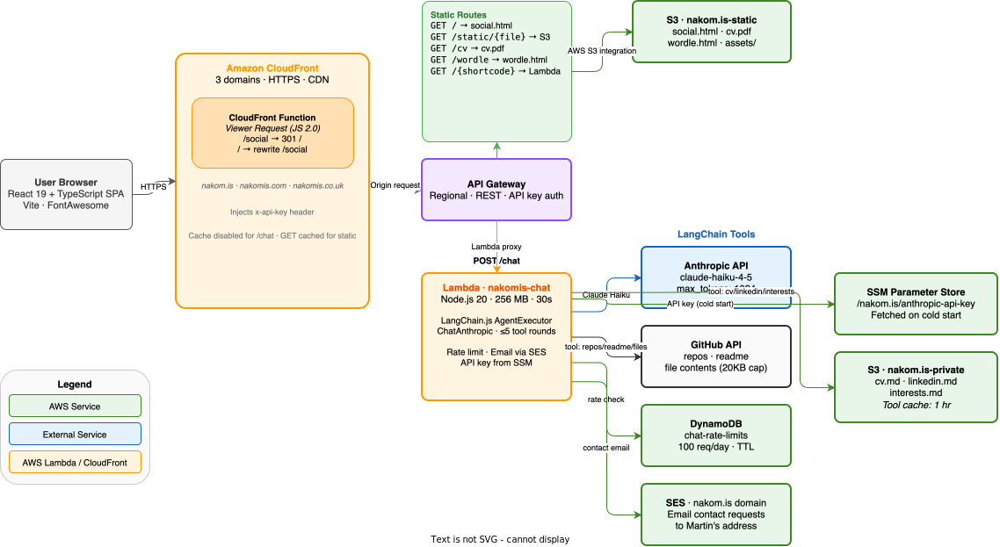

# nakom.is Social App

The React SPA that serves as the landing page for [nakom.is](https://nakom.is). It's a personal profile page with social links and an AI chat powered by Claude.

## Architecture



### Frontend (this app)

- **React 19 + TypeScript**, bundled with Vite
- Served from S3 via CloudFront at the root path `/`
- No client-side routing — single page, no router

### Backend (Lambda)

There are two Lambda handlers, both in `lambda/chat/`:

| Handler | Endpoint | Description |
|---------|----------|-------------|
| `stream-handler.ts` | `POST /chat-stream` | Primary chat handler — Lambda Function URL with `RESPONSE_STREAM`, streams SSE events |
| `handler.ts` | `POST /chat` | Email capture only — API Gateway REST, plain JSON response |

Both use **LangChain.js** (`ChatAnthropic` + `AgentExecutor`) to run a tool-calling agentic loop with up to 10 iterations. Model: `claude-haiku-4-5-20251001` (fast, cost-effective).

Other backend features:
- **Rate limiting** via DynamoDB (daily global limit)
- **Email capture** via SES — when a visitor leaves their email, it's forwarded to Martin
- **API key** stored in SSM Parameter Store (encrypted), loaded at Lambda cold start and cached

### AI tools available to the chat agent

| Tool | Description |
|------|-------------|
| `get_cv` | Reads `cv.md` from private S3 bucket |
| `get_linkedin_profile` | Reads `linkedin.md` from private S3 bucket |
| `get_interests` | Reads `interests.md` from private S3 bucket |
| `get_github_readme` | Fetches README for a GitHub repo |
| `list_repo_files` | Lists files/directories in a GitHub repo |
| `read_repo_file` | Reads a specific file from a GitHub repo (20KB cap) |

S3 reads are cached for 1 hour in a module-level Map; GitHub API calls are cached per-repo per Lambda instance.

### Infrastructure

- **CloudFront** — CDN, SSL termination, `/social` → `/` redirect, injects API key as `x-api-key` header
- **Lambda Function URL** (`nakomis-chat-stream`) — `invokeMode: RESPONSE_STREAM`, `authType: AWS_IAM`, secured by CloudFront OAC
- **API Gateway** — routes `POST /chat` to `handler.ts` Lambda (email capture)
- **S3 (public)** — serves the built React app from `/static/social-app/`
- **S3 (private)** — stores `cv.md`, `linkedin.md`, `interests.md` (not publicly accessible)
- **DynamoDB** — rate limit counters
- **SES** — outbound email for contact capture
- **SSM Parameter Store** — stores the Anthropic API key (encrypted)

## SSE streaming

Chat messages are handled via Server-Sent Events over a Lambda Function URL, rather than a conventional API Gateway + Lambda request/response cycle. This allows tool-call events to be delivered to the browser in real time, driving the animated connector lines.

### Flow

```
Browser
  │  POST /chat-stream
  │  Headers: Content-Type, x-amz-content-sha256
  ▼
CloudFront (OAC: SigV4 signing)
  ▼
Lambda Function URL (authType: AWS_IAM, invokeMode: RESPONSE_STREAM)
  │  awslambda.streamifyResponse() handler
  │  LangChain AgentExecutor + SSECallbackHandler
  ▼
SSE events streamed back:
  event: tool_start  {"tool":"get_cv"}
  event: tool_end    {"tool":"get_cv"}
  event: message     {"message":"...","remaining":95,"requestEmail":true}
  event: done        {}
  event: error       {"error":"..."}
```

### Notable implementation details

- **`x-amz-content-sha256` header** — CloudFront OAC requires a SHA-256 of the request body for POST requests, computed client-side using the Web Crypto API (CloudFront cannot compute this as it doesn't buffer the body).
- **1KB SSE padding** — CloudFront buffers small chunks before flushing (~1KB threshold). Each SSE event is padded to ≥1KB using a `:` comment line so that `tool_start`/`tool_end` events are flushed immediately and the browser animations start promptly.
- **Minimum tool display time** — the frontend enforces a 1.5-second minimum display time per tool, so blob animations are visible even when a tool completes almost instantly (i.e. when a cached result is returned).

See [docs/streaming-architecture.md](../docs/streaming-architecture.md) for the full technical write-up including CloudFront OAC gotchas, CDK escape hatches, and cross-stack SSM parameter passing.

## Connector line animations

`ConnectorLines.tsx` renders an SVG overlay (fixed, full-viewport, pointer-events: none) containing curved Bézier paths from each relevant social link icon to the chat panel.

Three lines are drawn, one per linked resource:

| Line colour | Source icon | Activated by tools |
|-------------|-------------|-------------------|
| Orange | CV | `get_cv` |
| Blue | LinkedIn | `get_linkedin_profile` |
| White/grey | GitHub | `get_github_readme`, `list_repo_files`, `read_repo_file` |

**Normal state:** gentle dashed animation along the path (2s cycle), low opacity.

**Active state** (when the corresponding tool is running):
- Dashes speed up (0.8s cycle), line brightens
- Source dot pulses and grows
- Two glowing blob circles (`animateMotion`) travel along the path in a staggered loop

`App.tsx` maintains an `activeTools: Set<string>` state. The streaming handler in `ChatWidget.tsx` adds to this set on `tool_start` events and removes after the minimum display time on `tool_end`. `ConnectorLines` and `ChatWidget` are siblings that share this state via props.

## API contract

### `POST /chat-stream` (SSE)

Used for all normal chat messages.

**Request:**
```json
{
  "messages": [
    { "role": "user", "content": "Tell me about your experience" },
    { "role": "assistant", "content": "Sure! ..." },
    { "role": "user", "content": "What about cloud?" }
  ]
}
```

Required header: `x-amz-content-sha256: <sha256-hex-of-body>`

**Response:** `text/event-stream` with the following event types:

```
event: tool_start
data: {"tool":"get_cv"}

event: tool_end
data: {"tool":"get_cv"}

event: message
data: {"message":"The assistant reply","remaining":87,"requestEmail":true}

event: done
data: {}

event: error
data: {"error":"Something went wrong"}
```

`requestEmail` is only present in the `message` event when the AI wants to trigger the email capture UI.

**Error responses** (non-SSE, plain HTTP):
- `400` — missing/invalid body, invalid message format
- `429` — daily rate limit exceeded
- `500` — internal server error

### `POST /chat` (JSON)

Used only for email capture submissions (triggered after `requestEmail: true`).

**Request:**
```json
{
  "messages": [...],
  "emailAddress": "visitor@example.com"
}
```

**Response (200):**
```json
{
  "message": "Thanks! I've passed your email to Martin — he'll be in touch.",
  "remaining": 87
}
```

**Error responses:**
- `400` — missing/invalid body, invalid email
- `429` — daily rate limit exceeded
- `500` — internal server error

### Rate limiting

The Lambda enforces a global daily request limit (configurable via the `DAILY_RATE_LIMIT` environment variable, default 100). Remaining capacity is returned in every response.

### Email capture flow

1. The AI appends `[REQUEST_EMAIL]` to its response when contact capture is appropriate
2. The Lambda strips the token and sets `requestEmail: true` in the SSE `message` event
3. The frontend shows an email input field
4. On submission, the client POSTs to `/chat` with `emailAddress` set
5. The Lambda forwards the email address + last 6 messages of conversation to Martin via SES

### Conversation limits

- Max 10 user turns per session (enforced client-side)
- Last 20 messages sent to the Lambda (backend cap)
- Max 2000 characters per user message

## Components

| Component | Description |
|-----------|-------------|
| `App.tsx` | Root layout — arranges social links, chat widget, and SVG connector lines; owns the `activeTools` state |
| `SocialLinks.tsx` | Row of icon links (CV, LinkedIn, GitHub, Bluesky, Facebook, Twitter) |
| `ChatWidget.tsx` | Full chat UI — SSE streaming, message history, input, email capture, loading state; drives `activeTools` updates |
| `ChatMessage.tsx` | Individual message bubble (user / assistant) |
| `ConnectorLines.tsx` | Fixed SVG overlay with animated Bézier connector lines; animates blobs when a tool is active |
| `types.ts` | Shared TypeScript interfaces (`ChatMessage`, `ChatResponse`, `ChatError`, `TOOL_TO_LINK`, `TOOL_DESCRIPTIONS`) |

## Local development

```bash
cd social-app
npm install
npm run dev
```

The dev server proxies `/chat` and `/chat-stream` requests via `vite.config.ts`. You'll need the Lambda running locally or pointing at a deployed API Gateway / Function URL.

## Build & deploy

```bash
cd social-app
npm run build
bash scripts/deploy.sh
```

The deploy script syncs `dist/` to the S3 public bucket under `/static/social-app/` and invalidates the CloudFront cache.

## Architecture diagram

`architecture.drawio` is the source for the diagram above. The SVG is auto-generated on commit by the pre-commit hook in `.githooks/pre-commit`. To activate the hook:

```bash
git config core.hooksPath .githooks
```

To regenerate the SVG manually:

```bash
/Applications/draw.io.app/Contents/MacOS/draw.io -x social-app/architecture.drawio -f svg -s 1 social-app/architecture.svg
```
